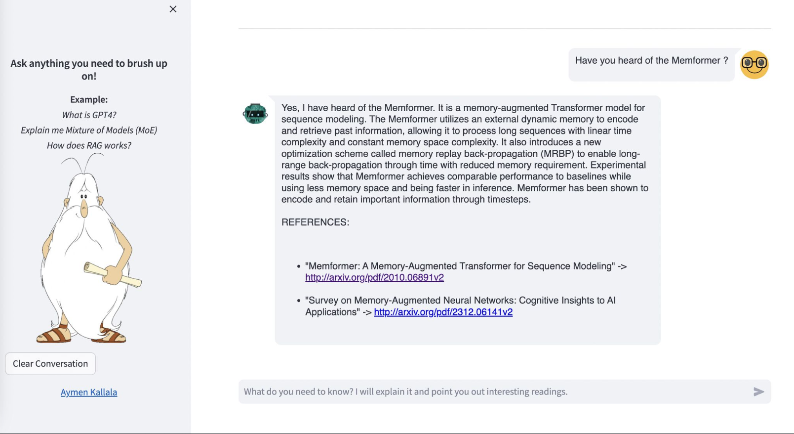
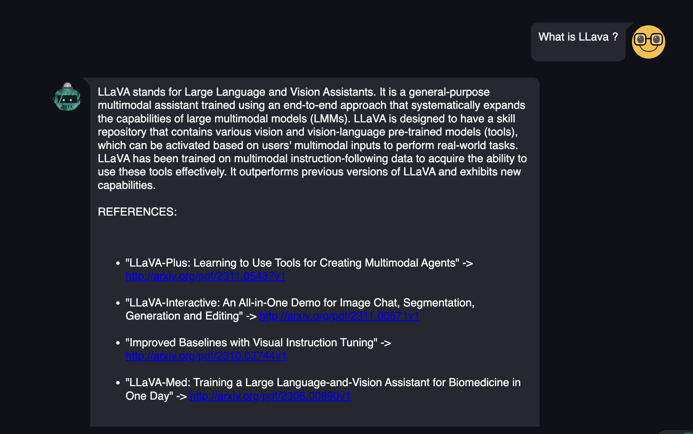

# RAG - Maestro ([Now Live!](https://rag-maestro-o2wbip4gla-uc.a.run.app/))
RAG-Maestro is an up-to-date LLM assistant designed to provide clear and concise explanations of scientific concepts **and relevant papers**. As a Q&A bot, it does not keep track of your conversation and will treat each input independently.

<ins>**RAG-Maestro is now [Live!](https://rag-maestro-o2wbip4gla-uc.a.run.app/)**</ins>

# Examples

What is LLava?            |  Do you know what the Memformer is?
:-------------------------:|:-------------------------:
  |  

# Implementation Details

The bot is composed of three building blocks that work sequentially:

### A Keywords extractor

RAG-Maestro first tasks is to extract from your request the keywords to browse for. the [RAKE](https://www.analyticsvidhya.com/blog/2021/10/rapid-keyword-extraction-rake-algorithm-in-natural-language-processing/) (Rapid Keyword Extraction Algorithm) from `nltk` is used.

### A Paper browser

Once the keywords extracted, they are used to retrieve the 5 most relevant papers from [arxiv.org](https://www.arxiv.org/). These papers are then downloaded and scrapped.

To build the scraper, I used the open-source `arxiv` API and  `PyPDF2` to ease the pdf reading.

### A RAG Pipeline ([Paper](https://arxiv.org/pdf/2005.11401.pdf))

That retrieves the most relevant information from the scraped papers relatively to the query, and takes it as context to summarize. One of the main features I implemented (prompt engineering) is that the bot is *citing its sources*. Hence, it becomes possible to assess the veracity of the provided answer. The pipeline is using OpenAI LLMS (`embedding-v3` and `gpt-3.5-turbo`) to process the retrieval and the generation steps. Like every LLM, RAG-Maestro can be subject to hallucinations. **Making it citing the sources can help us to detect a hallucination**.

I used [llama_index]( https://docs.llamaindex.ai/en/stable/) to build the RAG pipeline, specifically picked a "tree_summarizer" form query engine to generate the answer. All the hyperparameters are stored in an editable `config.yml` file.

# Commands

### Running the app locally from this repository
- clone this repository
- Create a new Python environment provided with pip
- run `pip install -r requirements.txt`
- run `streamlit run src/app.py`
- Now open the 'External URL' in your browser. Enjoy the bot.

